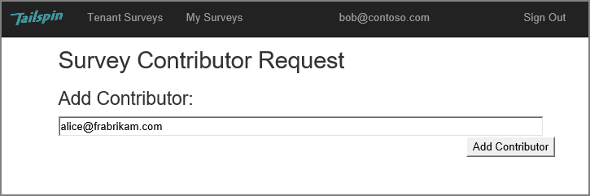

# About the Tailspin Surveys application

Tailspin is a fictitious company that is developing a SaaS application named Surveys. This application enables organizations to create and publish online surveys.

- An organization can sign up for the application.
- After the organization is signed up, users can sign into the application with their organizational credentials.
- Users can create, edit, and publish surveys.

> To get started with the application, see [Running the Surveys application](running-the-app.md).

This screenshot shows the Edit Survey page:

Notice that the user is signed in with his organizational identity, `bob@contoso.com`.

Users can view surveys created by other users within the same tenant.

When a user creates a survey, he or she can invite other people to be contributors on the survey. Contributors can edit the survey, but cannot delete or publish it.  

A user can add contributors from other tenants, which enables cross-tenant sharing of resources. In this screenshot, Bob (`bob@contoso.com`) is adding Alice (`alice@fabrikam.com`) as a contributor to a survey that Bob created.

When Alice logs in, she sees the survey listed under "Surveys I can contribute to".

Note that Alice signs into her own tenant, not as a guest of the Contoso tenant. Alice has contributor permissions only for that survey &mdash; she cannot view other surveys from the Contoso tenant.

## Architecture

The Surveys application consists of a web front end and a web API backend. Both are implemented using [ASP.NET 5](https://docs.asp.net/en/latest/).

The web application uses Azure Active Directory (Azure AD) to authenticate users. The web application also calls Azure AD to get OAuth 2 access tokens for the Web API. Access tokens are cached in Azure Redis Cache. The cache enables multiple instances to share the same token cache (e.g., in a server farm).

