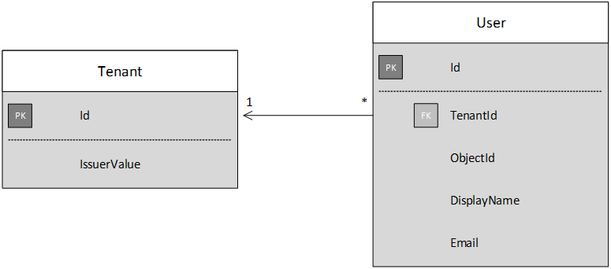

# Sign-up and tenant onboarding

This chapter describes how to implement a _sign-up_ process in a multi-tenant application, which allows a customer to sign up their organization for your application.
There are several reasons to implement a sign-up process:

-	Allow an AD admin to consent for the customer's entire organization to use the application.
-	Collect credit card payment or other customer information.
-	Perform any one-time per-tenant setup needed by your application.

## Admin consent and Azure AD permissions

In order to authenticate with Azure AD, an application needs access to the user's directory. At a minimum, the application needs permission to read the user's profile. The first time that a user signs in, Azure AD shows a consent page that lists the permissions being requested. By clicking **Accept**, the user grants permission to the application.

By default, consent is granted on a per-user basis. Every user who signs in sees the consent page. However, Azure AD also supports  _admin consent_, which allows an AD administrator to consent for an entire organization.

When the admin consent flow is used, the consent page states that the AD admin is granting permission on behalf of the entire tenant:


After the admin clicks **Accept**, other users within the same tenant can sign in, and Azure AD will skip the consent screen.

Only an AD administrator can give admin consent, because it grants permission on behalf of the entire organization. If a non-administrator tries to authenticate with the admin consent flow, Azure AD displays an error:

If at a later point the application requires additional permissions, the customer will need to remove the application from the tenant and sign up again, in order to consent to the updated permissions.  


# Implementing tenant sign-Up

For the Tailspin Surveys application,  we defined several requirements for the sign-up process:

-	A tenent must sign up before users can sign in.
-	Sign-up uses the admin consent flow.
-	Sign-up adds the user's tenant to the application database.
-	After a tenant signs up, the application shows an onboarding page.

In this section, we'll walk through our implementation of the sign-up process.
It's important to understand that "sign up" versus "sign in" is an application concept. During the authentication flow, Azure AD does not inherently know whether the user is in process of signing up. It's up to the application to keep track of the context.

When an anonymous user visits the Surveys application, the user is shown two buttons, one to sign in, and one to "enroll your company" (sign up).


These buttons invoke actions in the `AccountController` class.

> See `/src/MultiTenantSurveyApp/Controllers/AccountController.cs`

The `SignIn` action returns a `ChallegeResult`, which causes the OpenID Connect middleware to redirect to the authentication endpoint. This is the default way to trigger authentication in ASP.NET 5.  

```
[AllowAnonymous]
public IActionResult SignIn()
{
    return new ChallengeResult(
        OpenIdConnectDefaults.AuthenticationScheme,
        new AuthenticationProperties
        {
            RedirectUri = Url.Action("SignInCallback", "Account")
        });
}
```

Now compare the SignUp action:

```
[AllowAnonymous]
public async Task<IActionResult> SignUp()
{
  var tenant = GenerateCsrfTenant();
  try
  {
      await _tenantManager.CreateAsync(tenant);
  }
  catch
  {
      // Handle error
  }

  // Workaround for https://github.com/aspnet/Security/issues/546
  HttpContext.Items.Add("signup", "true");

  var state = new Dictionary<string, string> { { "signup", "true" }, { "csrf_token", tenant.IssuerValue } };
  return new ChallengeResult(
      OpenIdConnectDefaults.AuthenticationScheme,
      new AuthenticationProperties(state)
      {
          RedirectUri = Url.Action(nameof(SignUpCallback), "Account")
      });
}
```

Note: This code includes a workaround for a known bug in ASP.NET 5 RC1. See the [Admin Consent](#admin-consent) section for more information.

Like `SignIn`, the `SignUp` action also returns a `ChallengeResult`. But this time, we add two pieces of state information to the `AuthenticationProperties` in the `ChallengeResult`:

-	_signup_: A Boolean flag, indicating that the user has started the sign-up process.
-	_csrf_token_: A random GUID to guard against cross-site request forgery (CSRF) attacks. We'll see how that's used in the section [Registering a Tenant](#registering-a-tenant). Note that the CSRF token is also stored in the application database, in the call to `_tenantManager.CreateAsync`.

The state information in `AuthenticationProperties` gets added to the OpenID Connect [state](http://openid.net/specs/openid-connect-core-1_0.html#AuthRequest) parameter, which round trips during the authentication flow.


After the user authenticates in Azure AD and gets redirected back to the application, the authentication ticket contains the state. We are using this fact to make sure the "signup" and "csrf_token" values persist through the entire authentication flow.

## Adding the admin consent prompt

In Azure AD, the admin consent flow is triggered by adding a "prompt" parameter to the query string in the authentication request:

    /authorize?prompt=admin_consent&...

The Surveys application adds the prompt during the `RedirectToAuthenticationEndpoint` event. This event is called right before the middleware redirects to the authentication endpoint.

```
public override Task RedirectToAuthenticationEndpoint(RedirectContext context)
{
    if (context.IsSigningUp())
    {
        context.ProtocolMessage.Prompt = "admin_consent";
    }

    _logger.RedirectToIdentityProvider();
    return Task.FromResult(0);
}
```

> See /src/MultiTenantSurveyApp/SurveyAuthenticationEvents.cs

Setting` ProtocolMessage.Prompt` tells the middleware to add the "prompt" parameter to the authentication request.

Note that the prompt is only needed during sign-up. Regular sign-in should not include it. To distinguish between them, we check for the `signup` value in the authentication state. The following extension method checks for this condition:

```
internal static bool IsSigningUp(this BaseControlContext context)
{
    if (context == null)
    {
        throw new ArgumentNullException(nameof(context));
    }
    // Note - Due to https://github.com/aspnet/Security/issues/546, we cannot get to the authentication properties
    // from the context in the RedirectToAuthenticationEndpoint event to check for sign up.  This bug is currently
    // slated to be fixed in the RC2 timeframe.  When this is fixed, remove the workaround that checks the HttpContext

    string signupValue;
    object obj;
    // Check the HTTP context and convert to string
    if (context.HttpContext.Items.TryGetValue("signup", out obj))
    {
        signupValue = (string)obj;
    }
    else
    {
        // It's not in the HTTP context, so check the authentication ticket.  If it's not there, we aren't signing up.
        if ((context.AuthenticationTicket == null) ||
            (!context.AuthenticationTicket.Properties.Items.TryGetValue("signup", out signupValue)))
        {
            return false;
        }
    }

    // We have found the value, so see if it's valid
    bool isSigningUp;
    if (!bool.TryParse(signupValue, out isSigningUp))
    {
        // The value for signup is not a valid boolean, throw                
        throw new InvalidOperationException($"'{signupValue}' is an invalid boolean value");
    }

    return isSigningUp;
}
```

> See /src/MultiTenantSurveyApp\Security/BaseControlContextExtensions.cs

> Note: This code includes a workaround for a known bug in ASP.NET 5 RC1. In the `RedirectToAuthenticationEndpoint` event, there is no way to get the authentication properties that contains the "signup" state. As a workaround, the `AccountController.SignUp` method also puts the "signup" state into the `HttpContext`. This works because `RedirectToAuthenticationEndpoint` happens before the redirect, so we still have the same `HttpContext`.

## Registering a Tenant

The Surveys application stores some information about each tenant and user in the application database.



In the Tenant table, IssuerValue is the value of the issuer claim for the tenant. For Azure AD, this is `https://sts.windows.net/<tentantID>` and gives a unique value per tenant.

When a new tenant signs up, the Surveys application writes a tenant record to the database. This happens inside the `AuthenticationValidated` event. (Don't do it before this event, because the ID token won't be validated yet, so you can't trust the claim values. See [Authentication](02-authentication.md)).

Here is the relevant code from the Surveys application:

```
public override async Task AuthenticationValidated(AuthenticationValidatedContext context)
{
    var principal = context.AuthenticationTicket.Principal;
    var accessTokenService = context.HttpContext.RequestServices.GetService<IAccessTokenService>();
    try
    {
        var userId = principal.GetObjectIdentifierValue();
        var tenantManager = context.HttpContext.RequestServices.GetService<TenantManager>();
        var userManager = context.HttpContext.RequestServices.GetService<UserManager>();
        var issuerValue = principal.GetIssuerValue();

        // Normalize the claims first.
        NormalizeClaims(principal);
        var tenant = await tenantManager.FindByIssuerValueAsync(issuerValue);

        if (context.IsSigningUp())
        {
            if (tenant == null)
            {
                tenant = await SignUpTenantAsync(context, tenantManager);
            }

            // In this case, we need to go ahead and set up the user signing us up.
            await CreateOrUpdateUserAsync(context.AuthenticationTicket, userManager, tenant);
        }
        else
        {
            if (tenant == null)
            {
                throw new SecurityTokenValidationException($"Tenant {issuerValue} is not registered");
            }

            await CreateOrUpdateUserAsync(context.AuthenticationTicket, userManager, tenant);
        }
    }
    catch
    {
         // Handle error
    }
}
```

> See /src/MultiTenantSurveyApp/SurveyAuthenticationEvents.cs - This code snippet omits some logging and other details that aren't relevant to this discussion.

This code does the following:

1.	Check if the tenant's issuer value is already in the database. If the tenant has not signed up, `FindByIssuerValueAsync` returns null.
2.	If the user is signing up:
  1.	Add the tenant to the database (`SignUpTenantAsync`).
  2.	Add the authenticated user to the database (`CreateOrUpdateUserAsync`).
3.	Otherwise complete the normal sign-in flow:
  1.	If the tenant's issuer was not found in the database, it means the tenant is not registered, and the customer needs to sign up. In that case, throw an exception to cause the authentication to fail.
  2.	Otherwise, create a database record for this user, if there isn't one already (`CreateOrUpdateUserAsync`).

Here is the `SignUpTenantAsync` method that adds the tenant to the database.

```
private async Task<Tenant> SignUpTenantAsync(BaseControlContext context, TenantManager tenantManager)
{
    if (context == null)
    {
        throw new ArgumentNullException(nameof(context));
    }

    if (tenantManager == null)
    {
        throw new ArgumentNullException(nameof(tenantManager));
    }

    var tenant = await ValidateSignUpRequestAsync(context.AuthenticationTicket, tenantManager);
    try
    {
        var principal = context.AuthenticationTicket.Principal;
        tenant.IssuerValue = principal.GetIssuerValue();
        await tenantManager.UpdateTenantAsync(tenant);
    }
    catch
    {
        // Something happened when we were setting up our tenant, so we need to clean up the database.
        // [masimms] What happens if there is an exception in this flow?  Is there a higher order handler?
        await tenantManager.DeleteTenantAsync(tenant);

        throw;
    }

    return tenant;
}
```

The method validates the signup request (`ValidateSignUpRequestAsync`) and then writes the issuer value into the database. The `ValidateSignupRequestAsync` method validates the CSRF token in the authentication state:

```
private async Task<Tenant> ValidateSignUpRequestAsync(AuthenticationTicket authenticationTicket, TenantManager tenantManager)
{
    if (authenticationTicket == null)
    {
        throw new ArgumentNullException(nameof(authenticationTicket));
    }

    string csrfToken;
    if ((!authenticationTicket.Properties.Items.TryGetValue("csrf_token", out csrfToken)) || (string.IsNullOrWhiteSpace(csrfToken)))
    {
        throw new InvalidOperationException("Missing csrf_token");
    }

    // See if we made this request.  If tenant is null, we did not initiate the request flow - throw an error
    var tenant = await tenantManager.FindByIssuerValueAsync(csrfToken);
    if (tenant == null)
    {
        throw new InvalidOperationException("Invalid CSRF token.");
    }

    return tenant;
}
```

The CSRF token prevents cross-site request forgeries.  Remember that we store this value in the database before starting the authentication flow. By checking the CSRF token against the value in the database, we ensure that the request originated from the application.

> Note: If you try to sign up the tenant that is hosting the app, Azure AD returns a generic error. To avoid this, you can seed the database with the SaaS provider's tenant.

Here is a summary of the entire sign-up flow in the Surveys application:

1.	The user clicks the **Sign Up** button.
2.	The `AccountController.SignUp` action returns a challege result.  The authentication state includes "signup" and "csrf_token" values.
3.	In the `RedirectToAuthenticationEndpoint` event, add the `admin_consent` prompt.
4.	The OpenID Connect middleware redirects to Azure AD and the user authenticates.
5.	In the `AuthenticationValidated` event, look for the "signup" state.
6.	Check csrf_token against the database.
7.	Add the tenant to the database.
