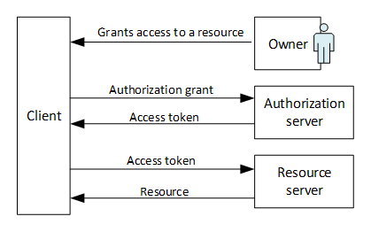
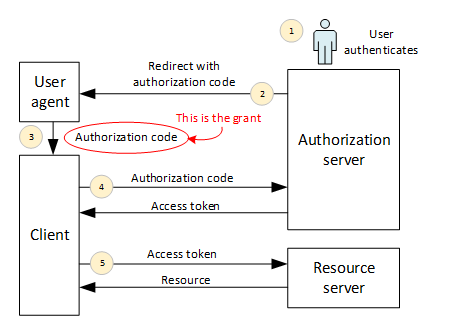
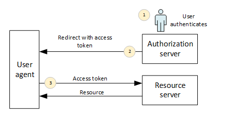
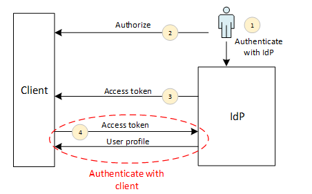

# Overview of OAuth 2 and OpenID Connect

This guidance talks a lot about authentication using the OpenID Connect protocol. For the most part, you can configure OpenID Connect in your application and the authentication will "just work." However, it's still good to understand what's happening when a user signs in. This chapter provides a high-level overview of OpenID Connect.

OpenID Connect is built on top of another specification, OAuth 2, so we'll start there.

## OAuth 2

OAuth 2 is an authorization protocol. More specifically, it’s a protocol for _granting access to resources_.

For example, imagine a web app for a photo printing service. You might use the app to print photos that you uploaded to a social media site, like Facebook. To make this work, the app needs permission to read your photos. But you don’t want to give the app unrestricted access to your social media account. Instead, you want to grant limited access: “just read access, and just for my photos.” OAuth 2 was designed for exactly this type of scenario.

OAuth 2 defines four roles:

-	**Resource server**. A server that holds a protected resource (my photos).
-	**Resource owner**. The person who can grant access to the resource (me).
-	**Client**. An application that wants to access the resource (the photo printing app).
-	**Authorization server**. A server that authorizes the client to access the resource. The authorization is done on behalf of the owner.

> Note: Resource and authorization servers are logical roles. In practice, they might be endpoints within the same web service.

Here’s how OAuth 2 works at a very abstract level:

1.	The resource owner grants the client access to a resource. There are different ways this can happen. Conceptually, the client receives a grant in some form. The grant represents the authorization.
2.	The client presents the grant to the authorization server.
3.	The authorization server validates the grant and issues an access token to the client.
4.	The client presents the token to the resource server.
5.	The resource server returns the resource.

An _access token_ is a credential that represents the authorization. Tokens are generally opaque to the client, but the resource server knows how to validate them. The core OAuth2 specification (RFC [6479](http://tools.ietf.org/html/rfc6749)) does not define a token format, or how they are generated and validated.

Most implementations use _bearer tokens_. A bearer token is an access token with the property that anyone who possesses the token can use it. Bearer tokens don’t require any cryptographic signature from the client, and there is no mechanism for the resource server to verify that a particular token was issued to a particular client. For that reason, bearer tokens must be protected using SSL, to avoid leaking them.

Here are some important points to note:

-	OAuth does not require the client to see the owner’s credentials. The only requirement is that the authorization server understands the grant.
-	The grant and the access token represent a _limited_ authorization. The client does not impersonate the user or give the user’s credentials to the resource server.
-	The resource server trusts the authorization server. (That’s implied by the fact that the resource server accepts access tokens issued by the authorization server.)
-	The resource and authorization servers do not trust the client.

So far, all of this is fairly abstract, especially the idea of the “grant.” Let's look at two specific grant types: Authorization code grant, and implicit grant.

### Authorization code grant

**Authorization code grant** is appropriate for web-server based applications. In this flow, the web app retrieves the access token on the server side. The token never passes through the user agent. (The [user agent][user-agent] is the client software that makes the HTTP requests, such as a web browser.)

1.	The client sends the user-agent to the authorization endpoint, where the user authenticates. Typically, the authorization server shows a login screen. There may be additional safeguards such as 2-factor authentication. In any case, this step is outside the client’s control.
2.	The authorization server redirects the user-agent back to the client. The redirect URL includes an _authorization code_ in the query string. This code represents the grant.
3.	The user-agent follows the redirect. The client retrieves the authorization code from the query string.
4.	The client sends the authorization code to the authorization server, along with a client ID and a client secret. The authorization server returns an access token.
5.	To get the resource, the client includes the token in the Authorize header of the HTTP requests to the resource server.

> There is a variation of this flow where the authorization server uses HTTP POST to send the authorization code, instead than putting the code in the query string (step 2).

### Implicit grant

Implicit grant is intended for web apps that run entirely in the browser (e.g., single page apps).

1.	The client sends the user-agent to the authorization endpoint, and the user authenticates.
2.	The redirect URL includes the accees token in the URI fragment ('#').
3.	As before, the client sends the token in the Authorize header.

In this flow, there is no authorization code. The authorization server returns the access token directly to the user agent. There is no client secret, because the application code is loaded into the browser, so it cannot be kept confidential.

This flow is called "implicit" because there is no step where the client receives an explicit grant. Compare this to the previous flow, where the authorization code represents the grant.

## Using OAuth 2 for authentication

Sometimes you will hear that an app “authenticates using OAuth2,” but that’s not strictly accurate. OAuth 2 is an authorization protocol. It doesn't tell the client who granted the authorization. In fact, OAuth 2 has no notion of user identity.

However, OAuth 2 can be used to _build_ an authentication protocol. The idea is to treat the user’s identity as a resource. The identity provider (IDP) acts as both authorization server and resource server.

1.	The user authenticates with the IDP
2.	The user authorizes the client to get the user’s profile from the IDP. This may be a limited grant, to view only portions of the user's identity. For example, name and email address, but not phone number.
3.	The client gets an OAuth access token from the IDP.
4.	The client uses this token to request the user profile.

For step (4), the IDP must provide an API for getting the profile. For example, Facebook provides the Facebook Graph API. Crucially, whatever API is used, it falls outside the scope of OAuth.

Notice that the user authenticates with the IDP in step (1). This is a prerequisite for authorizing the client. But at that point, the user is still not authenticated with the _client_. The client does not authenticate the user until step (4), when it requests the user’s ID from the IDP.

Two problems with this approach:

-	The API to get the user profile is not part of OAuth. As a result, many "OAuth authentication" solutions use proprietary APIs, requiring separate client libraries for each.
-	OAuth tokens are not bound to clients. A malicious user-agent can get a valid token, and then send it to some other client by forging the redirect URL. In that case, the client did not actually authenticate the user. The client simply got _someone's_ user profile.

Which brings us to OpenID Connect …

## OpenID Connect

OpenID Connect is an authentication protocol built on top of OAuth 2, and was designed to solve some of the problems with using OAuth 2 for authentication.

OpenID Connect adds the concept of an ID token. An ID token holds claims about the authenticated user. The ID token is also signed and has an audience. The audience specifies who the token was issued for, and contains the client ID of the client. This lets the client verify that the token was not tampered with, and was not issued to some other client.

In OpenID Connect, the authorization server exposes several endpoints:

-	Authorization endpoint: Where the user authenticates.
-	Token endpoint: Issues OAuth2 access tokens.
-	User info endpoint: Returns the user's profile. This is a protected resource that requires an access token.
-	Metadata endpoint (optional). This is a JSON document that lists the URLs for the authorization endpoint, token endpoint, user info endpoint, and the URL for the signing keys.  The metadata endpoint is not required; it is defined in a separate specification called [OpenID Connect Discovery](https://openid.net/specs/openid-connect-discovery-1_0.html).

OpenID Connect defines three flows:

- **Authorization code flow**
    - Returns an authorization code. The client can exchange this for an ID token and access token.
    - The user agent does not see the tokens, which protects against malicious user agents.
    - The authorization server can authenticate the client.
- **Implicit flow**
    - Returns the access token and ID token directly.
    - As with OAuth 2, implicit flow is intended for clients implemented entirely in script.
    - The client is identified by the redirect URI, not by a client secret.
- **Hybrid flow**
    - Combines aspects of the other two flows.
    - Can return an access token and/or ID token directly.
    - Also returns an authorization code, which the client can exchange for an access token or ID token.

The client specifies the flow in the `response_type` parameter of the authentication request:

Flow | response_type
-----|--------------
Authorization code | "`code`"
Implicit | "`id_token token`" or "`id_token`"
Hybrid | "`code id_token`", "`code token`", or "`code id_token token`"

## Further reading

- [OpenID Connect in a nutshell](http://nat.sakimura.org/2012/01/20/openid-connect-nutshell/)

<-- links -->

[user-agent]: https://tools.ietf.org/html/rfc7230#section-2.1
